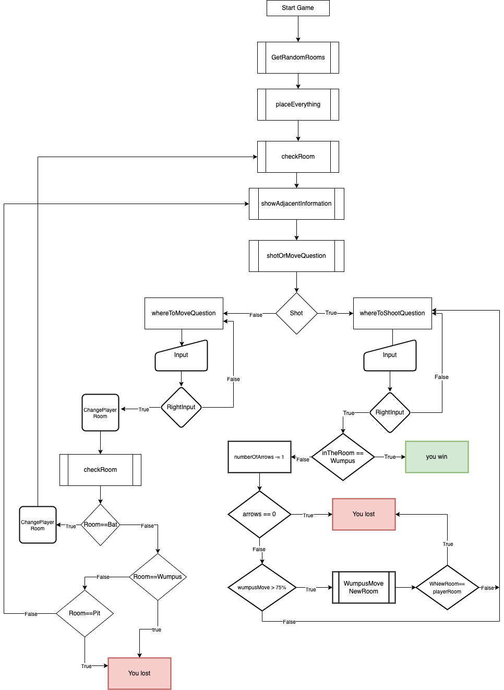

# hunt-the-wumpus
 Text based game

#### run the game: ```node game.js```
#### run the test: ```npm install``` ```npm test```

```
Assumptions:
Dangerous assets are randomly distributed in different rooms.
The user starts from a random room.
After each shot, the number of arrows is shown to the user.
The bat puts the player in a random room without other dangerous entities.
After putting the player in a room, the bat returns to its old room.
```

```
██╗░░██╗██╗░░░██╗███╗░░██╗████████╗  ████████╗██╗░░██╗███████╗
██║░░██║██║░░░██║████╗░██║╚══██╔══╝  ╚══██╔══╝██║░░██║██╔════╝
███████║██║░░░██║██╔██╗██║░░░██║░░░  ░░░██║░░░███████║█████╗░░
██╔══██║██║░░░██║██║╚████║░░░██║░░░  ░░░██║░░░██╔══██║██╔══╝░░
██║░░██║╚██████╔╝██║░╚███║░░░██║░░░  ░░░██║░░░██║░░██║███████╗
╚═╝░░╚═╝░╚═════╝░╚═╝░░╚══╝░░░╚═╝░░░  ░░░╚═╝░░░╚═╝░░╚═╝╚══════╝

░██╗░░░░░░░██╗██╗░░░██╗███╗░░░███╗██████╗░██╗░░░██╗░██████╗██╗
░██║░░██╗░░██║██║░░░██║████╗░████║██╔══██╗██║░░░██║██╔════╝██║
░╚██╗████╗██╔╝██║░░░██║██╔████╔██║██████╔╝██║░░░██║╚█████╗░██║
░░████╔═████║░██║░░░██║██║╚██╔╝██║██╔═══╝░██║░░░██║░╚═══██╗╚═╝
░░╚██╔╝░╚██╔╝░╚██████╔╝██║░╚═╝░██║██║░░░░░╚██████╔╝██████╔╝██╗
░░░╚═╝░░░╚═╝░░░╚═════╝░╚═╝░░░░░╚═╝╚═╝░░░░░░╚═════╝░╚═════╝░╚═╝

The game started
You hear a rustling.
Tunnel leads to 6. 14. 16
Shoot or Move (S/M) M
Where to move? 14
But you are going to new room with bat..
You are in room: 20
Tunnel leads to 16. 19. 13
Shoot or Move (S/M) M
Where to move? 13
You hear a rustling.
Tunnel leads to 12. 14. 20
Shoot or Move (S/M) M
Where to move? 14
But you are going to new room with bat..
You are in room: 11
You smell something terrible nearby.
Tunnel leads to 10. 12. 19
Shoot or Move (S/M) M
Where to move? 12
Tunnel leads to 3. 11. 13
Shoot or Move (S/M) M
Where to move? 1
Wrong input
Where to move? M
Wrong input
Where to move? 11
You smell something terrible nearby.
Tunnel leads to 10. 12. 19
Shoot or Move (S/M) S
Possible places to shoot 10,12,19
Where to shoot? 12
numberOfArrows:  4
There was nothing in there...
Shoot or Move (S/M) S
Possible places to shoot 10,12,19
Where to shoot? 19
numberOfArrows:  3
There was nothing in there...
Shoot or Move (S/M) M
Where to move? 10
You smell something terrible nearby.
Tunnel leads to 2. 9. 11
Shoot or Move (S/M) S
Possible places to shoot 2,9,11
Where to shoot? 9
You win!
```
```
Future version plans:
By adding a better text art structure, a nice UI can be achieved.
Level system can be added.
Difficulty level can be added.
```

 
 
